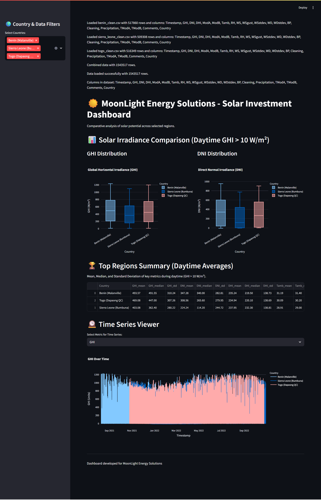

# Strategic Solar Investment Analysis  
*Week 0 Challenge – Solar Data Discovery*

## Project Summary

This project supports **MoonLight Energy Solutions** in identifying promising locations for solar energy investments across Benin, Sierra Leone, and Togo. By analyzing environmental and solar sensor data, the goal is to provide data-driven insights to guide sustainable and efficient solar panel deployment.

---

## Business Objective

- Analyze solar irradiance, temperature, humidity, wind, and related environmental data.
- Identify high-potential regions for solar panel installations.
- Help MoonLight optimize their investment strategy and operational sustainability.

---

## Dataset Overview

### Datasets include hourly measurements of:

- Solar irradiance (GHI, DNI, DHI)
- Module sensor data (ModA, ModB)
- Weather variables (temperature, humidity, wind speed/direction, pressure, precipitation)
- Sensor cleaning flags
- Timestamped records

### Files analyzed:  
`benin-malanville.csv`, `sierraleone-bumbuna.csv`, `togo-dapaong_qc.csv` (stored locally and gitignored).

---

## Project Structure & Workflow

- **Task 1:** Git setup, Python environment, CI/CD, and project organization.  
- **Task 2:** Data profiling, cleaning, and exploratory analysis per country using Jupyter notebooks.  
- **Task 3:** (In progress) Cross-country comparison with statistical analysis and visual summaries.  
- **Bonus:** Planned Streamlit dashboard for interactive data exploration.

---

## Getting Started

1. Clone repo and enter directory:  

   ```
   git clone https://github.com/saron03/solar-challenge-week1.git
   cd solar-challenge-week1
   ```
2. Create and activate Python virtual environment:

    ```
    python -m venv .venv
    source .venv/bin/activate  # Windows: .venv\Scripts\activate
    ```
3. Install dependencies:

    ```
    pip install -r requirements.txt
    ```
4. Place raw CSV data in a local data/ folder (not tracked by git).

5. Launch Jupyter to explore notebooks:
    ```
    jupyter notebook notebooks/
    ```

## MoonLight Solar Analysis Dashboard

<<<<<<< HEAD
This repository contains a Streamlit-based interactive dashboard for analyzing solar energy potential across three regions: Benin (Malanville), Sierra Leone (Bumbuna), and Togo (Dapaong QC). The project includes data cleaning, exploratory data analysis (EDA), and visualization of key solar metrics.
Project Overview
The dashboard visualizes cleaned solar data to support investment decisions for MoonLight Energy Solutions. It enables cross-country comparisons of solar irradiance metrics (GHI, DNI, DHI) and environmental factors (temperature, wind speed) through interactive plots and tables.

### Folder Structure
   solar-challenge-week1/
├── app/
│   ├── __init__.py
│   ├── main.py
│   ├── utils.py
├── data/
│   ├── benin_clean.csv
│   ├── sierraleone-bumbuna.csv
│   ├── togo_clean.csv
│   ├── benin-malanville.csv
│   ├── sierra_leone_clean.csv
│   ├── togo-dapaong_qc.csv
├── notebooks/
├── .gitignore
├── requirements.txt

### Screenshot 



## Setup Instructions
- To run the project locally, follow these steps:

### Clone the Repository:
```
git clone https://github.com/saron03/solar-challenge-week1.git
```
```
cd solar-challenge-week1
```
```
git checkout dashboard-dev
```

### Set Up a Virtual Environment:Using venv:
```
python -m venv venv
```
```
source venv/bin/activate  # On Windows: venv\Scripts\activate
```


### Install Dependencies:
```
pip install -r requirements.txt
```

### Ensure requirements.txt includes:
- streamlit
- pandas
- plotly

### Prepare Data:
- Place benin_clean.csv, sierraleone-bumbuna.csv, and togo_clean.csv in the data/ directory.
- Expected columns: Timestamp, GHI, DNI, DHI, Tamb, TModA, ModA, ModB, RH, WS, WSgust, WSstdev, WD, WDstdev, BP, Cleaning, Precipitation, TModB, Comments.
- Note: The data/ directory is ignored by .gitignore to prevent committing sensitive data.

### Run the Dashboard:
```
streamlit run app/main.py
```
- Access the dashboard at http://localhost:8501.

## Dashboard Features
- Country Selection: Choose one or more regions (Benin, Sierra Leone, Togo) via a sidebar multiselect.
- Interactive Visualizations:
                - Boxplots for Global Horizontal Irradiance (GHI) and Direct Normal Irradiance (DNI).
                - Time series viewer for metrics like GHI, DNI, and temperature.

- Summary Table: Displays mean, median, and standard deviation of key metrics for daytime data (GHI > 10 W/m²).
- Debugging: Logs data loading status and column names for troubleshooting.

## Key Performance Indicators (KPIs)

- Development Environment: Configured with Git, virtual environment, and dependencies (Task 1 completed).
- EDA and Statistical Analysis: Performed data profiling and cleaning for all three datasets, with visualizations and statistical summaries (Z-scores, correlations) in progress or completed locally (Task 2).
- Cross-Country Comparison: In progress, with the dashboard currently supporting Benin and Togo data; Sierra Leone data integration pending column verification for sierraleone-bumbuna.csv (Task 3).
- Dashboard Usability: Features intuitive navigation, interactive plots, and clear error messages; deployment to Streamlit Community Cloud planned (Bonus Task).

## Current Status
1. Task 1 (Environment Setup): Completed, with Git repository and virtual environment configured.

2. Task 2 (Data Profiling, Cleaning, EDA):

    - Benin (Malanville): Cleaned dataset (benin_clean.csv) loaded successfully.
    - Sierra Leone (Bumbuna): Using raw sierraleone-bumbuna.csv; column verification pending.
    - Togo (Dapaong QC): Cleaned dataset (togo_clean.csv) loaded successfully.

3. Task 3 (Cross-Country Comparison): In progress dashboard visualizes Benin and Togo data, with Sierra Leone integration ongoing.

4. Bonus Task (Interactive Dashboard): Initial dashboard implemented with interactive features; deployment to Streamlit Community Cloud is planned.


##  Deployment
The dashboard can be deployed to Streamlit Community Cloud:
1. Create an Account: Sign up at Streamlit Community Cloud.
2. Link Repository: Connect your GitHub repository, select the dashboard-dev branch, and set app/main.py as the main file.
3. Upload Data: Manually upload benin_clean.csv, sierraleone-bumbuna.csv, and togo_clean.csv to Streamlit Cloud, as they are not committed to Git.
4. Deploy: Launch the app to obtain a public URL.

## Next Steps

1. Verify columns for sierraleone-bumbuna.csv and integrate Sierra Leone data into the dashboard.
2. Complete Task 3 by adding statistical tests (e.g., ANOVA) and enhanced visualizations for cross-country comparisons.
3. Deploy the dashboard to Streamlit Community Cloud and share the public URL.
4. Compile interim and final reports summarizing findings and recommendations.

## About
This project is part of a solar energy analysis challenge for MoonLight Energy Solutions, focusing on data-driven insights for investment in solar infrastructure.
